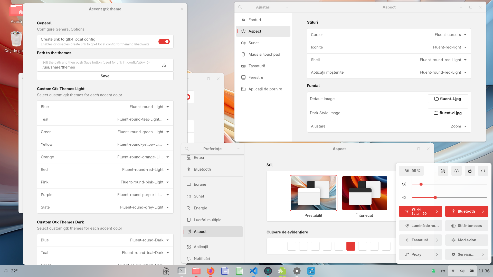
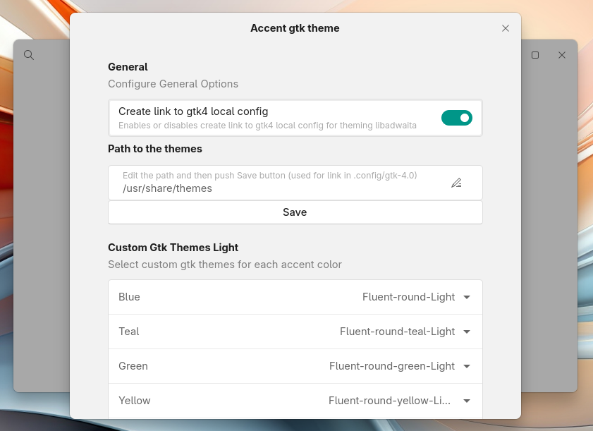
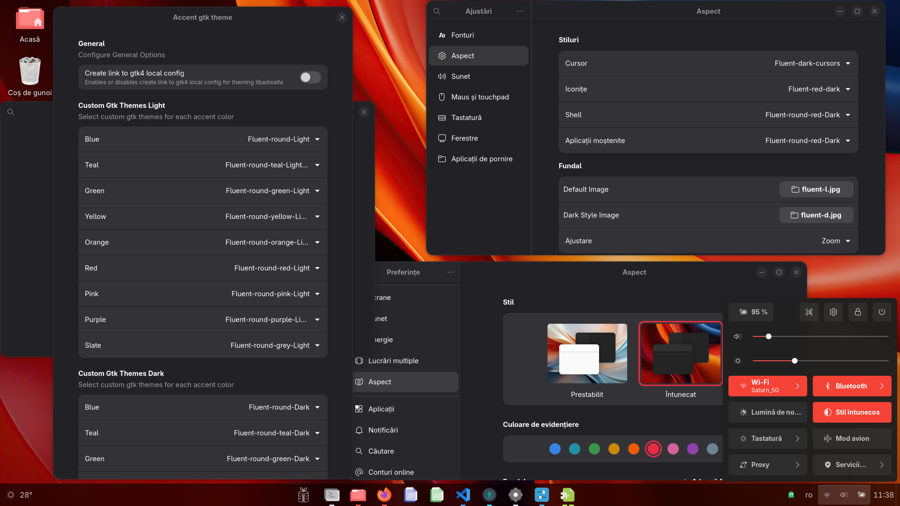

# Accent Gtk Theme
It is a Gnome extension that changes the gtk app theme, based on the accent color chosen by the user in Gnome Settings, Appearance screen and by preferred color schema Light or Dark.   
The extension is a modification of the [Accent Color Icon Theme Changer For GNOME](https://github.com/taiwbi/gnome-accent-directories) extension, thank you `Mohammad Mahdi Tayebi` for your work.  
This extension is included in [**BRGV-OS**](https://github.com/florintanasa/brgvos-void) Linux distribution.  

|                   With link                          |      Active Switch for link                        |                  Without link                                   |
|:----------------------------------------------------:|:---------------------------------------------------:|:---------------------------------------------------------------:|
||||

The Switch `Create link to gtk4 local config` create autmaticaly the link to gtk4 config for theming libadwaita in `home/user/.config/gtk-4.0/` at `Path to the themes` for `Fluent` themes and `MacTahoe` themes.

> [!IMPORTANT]  
> [**BRGV-OS**](https://github.com/florintanasa/brgvos-void) have all themes installed on `/usr/share/themes`, if you have the themes installed on `/home/<user name>/.themes` put the full path in `Path to the themes` and then press `Save` button.
  
## What is necessary ...
[**BRGV-OS**](https://github.com/florintanasa/brgvos-void) have all [Fluent themes](https://github.com/vinceliuice/Fluent-gtk-theme), [MacTahoe themes](https://github.com/vinceliuice/MacTahoe-gtk-theme) and [WhiteSur themes](https://github.com/vinceliuice/WhiteSur-gtk-theme) installed in `/usr/share/themes`, thank you `Vince` for your work.

Also is nice to have installed [Accent Icons](https://extensions.gnome.org/extension/7535/accent-directories/) and [Accent user theme](https://github.com/florintanasa/brgvos-void/tree/main/accent-user-theme%40brgvos), BRGV-OS have by defaults this.

For `WhiteSur theme` is necessary to apply the pach `diff_lib-install.patch` from `patch` directory, because not have some commands, thats exist in `MacTahoe theme`:
```bash
patch lib-install.sh < diff_lib-install.patch
```
The patch add next lines (whith +) to the `lib-install.sh` file:  
  
```patch
--- /home/florin/git/WhiteSur-gtk-theme/libs/orig/lib-install.sh
+++ /home/florin/git/WhiteSur-gtk-theme/libs/lib-install.sh
@@ -457,6 +457,12 @@
   echo '@import url("resource:///org/gnome/theme/gtk-dark.css");' >                           "${TARGET_DIR}/gtk-3.0/gtk-dark.css"
   glib-compile-resources --sourcedir="${TMP_DIR_T}" --target="${TARGET_DIR}/gtk-3.0/gtk.gresource" "${THEME_SRC_DIR}/main/gtk-3.0/gtk.gresource.xml"
 
+  cp -r "${THEME_SRC_DIR}/assets/gtk/common-assets/assets"                                    "${TARGET_DIR}/gtk-3.0"
+  cp -r "${THEME_SRC_DIR}/assets/gtk/scalable"                                                "${TARGET_DIR}/gtk-3.0/assets"
+  cp -r "${THEME_SRC_DIR}/assets/gtk/windows-assets/titlebutton${alt}${scheme}"               "${TARGET_DIR}/gtk-3.0/windows-assets"
+  sassc ${SASSC_OPT} "${THEME_SRC_DIR}/main/gtk-3.0/gtk${color}.scss"                         "${TARGET_DIR}/gtk-3.0/gtk.css"
+  sassc ${SASSC_OPT} "${THEME_SRC_DIR}/main/gtk-3.0/gtk-Dark.scss"                            "${TARGET_DIR}/gtk-3.0/gtk-dark.css"
+
   #--------------------GTK-4.0--------------------#
 
   mkdir -p                                                                                    "${TMP_DIR_F}"
@@ -471,6 +477,12 @@
   echo '@import url("resource:///org/gnome/theme/gtk.css");' >                                "${TARGET_DIR}/gtk-4.0/gtk.css"
   echo '@import url("resource:///org/gnome/theme/gtk-dark.css");' >                           "${TARGET_DIR}/gtk-4.0/gtk-dark.css"
   glib-compile-resources --sourcedir="${TMP_DIR_F}" --target="${TARGET_DIR}/gtk-4.0/gtk.gresource" "${THEME_SRC_DIR}/main/gtk-4.0/gtk.gresource.xml"
+
+  cp -r "${THEME_SRC_DIR}/assets/gtk/common-assets/assets"                                    "${TARGET_DIR}/gtk-4.0"
+  cp -r "${THEME_SRC_DIR}/assets/gtk/scalable"                                                "${TARGET_DIR}/gtk-4.0/assets"
+  cp -r "${THEME_SRC_DIR}/assets/gtk/windows-assets/titlebutton${alt}${scheme}"               "${TARGET_DIR}/gtk-4.0/windows-assets"
+  sassc ${SASSC_OPT} "${THEME_SRC_DIR}/main/gtk-4.0/gtk${color}.scss"                         "${TARGET_DIR}/gtk-4.0/gtk.css"
+  sassc ${SASSC_OPT} "${THEME_SRC_DIR}/main/gtk-4.0/gtk-Dark.scss"                            "${TARGET_DIR}/gtk-4.0/gtk-dark.css"
 
   #----------------Cinnamon-----------------#
```
After that we can build or install the theme.  
  
In [**BRGV-OS**](https://github.com/florintanasa/brgvos-void) also is instalated [Fluent icon theme](https://github.com/vinceliuice/Fluent-icon-theme), [MacTahoe icons theme](https://github.com/vinceliuice/MacTahoe-icon-theme) and [WhiteSur icons theme](https://github.com/vinceliuice/WhiteSur-icon-theme).  
  

## Warning 

The open-source software included in **BRGV-OS** is distributed in the hope that it will be useful, but **WITHOUT ANY WARRANTY**.

The work is in progress..

